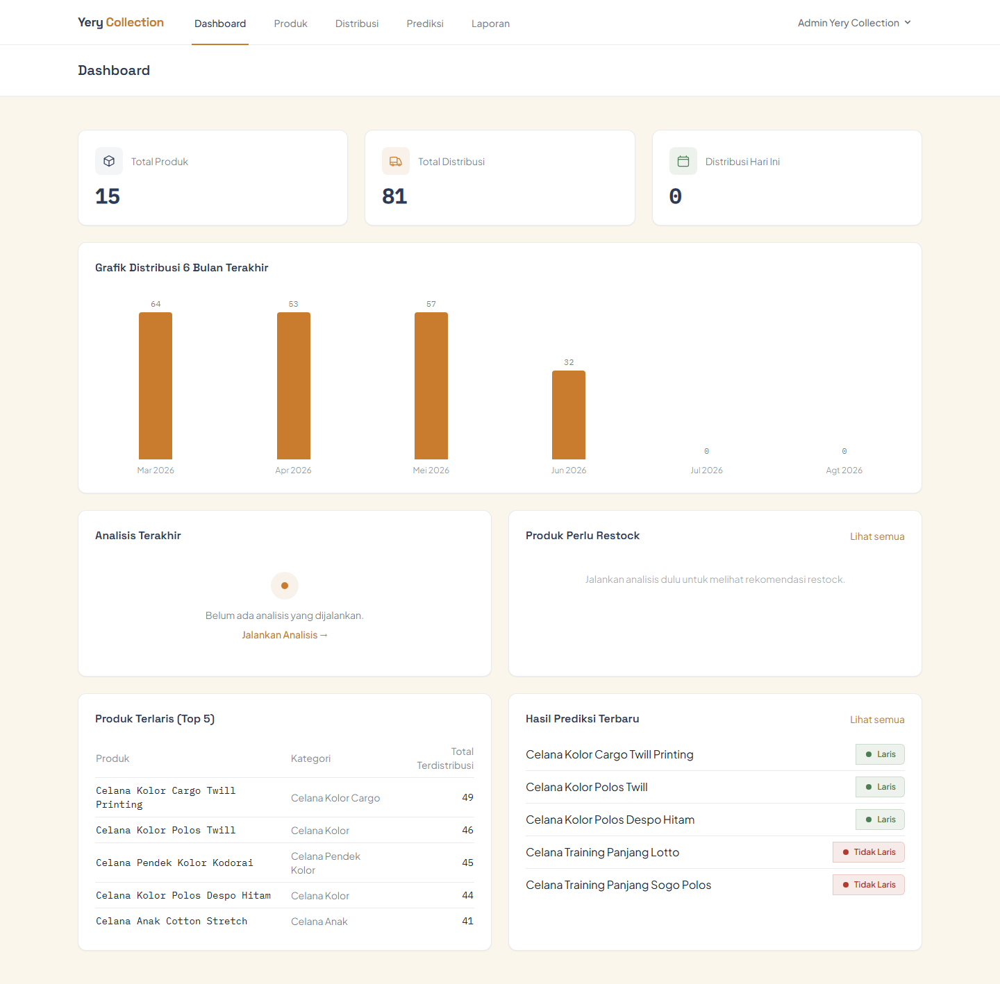
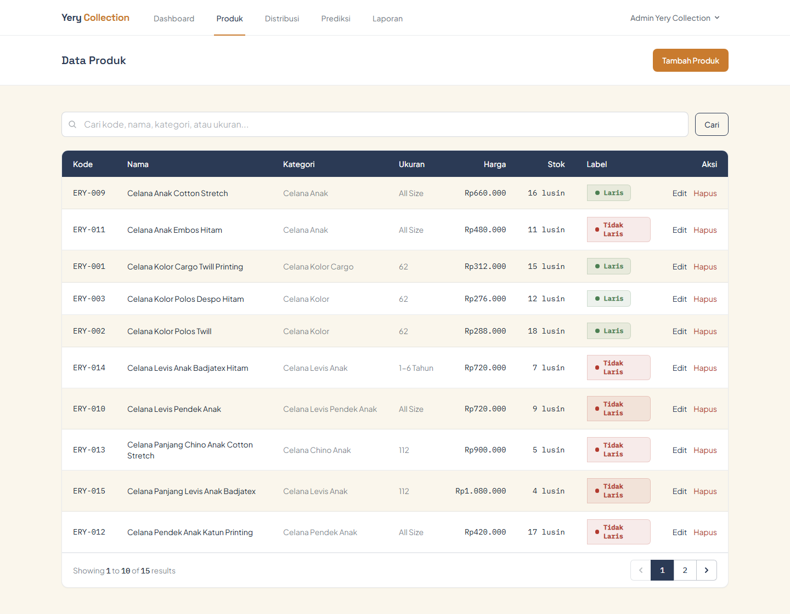
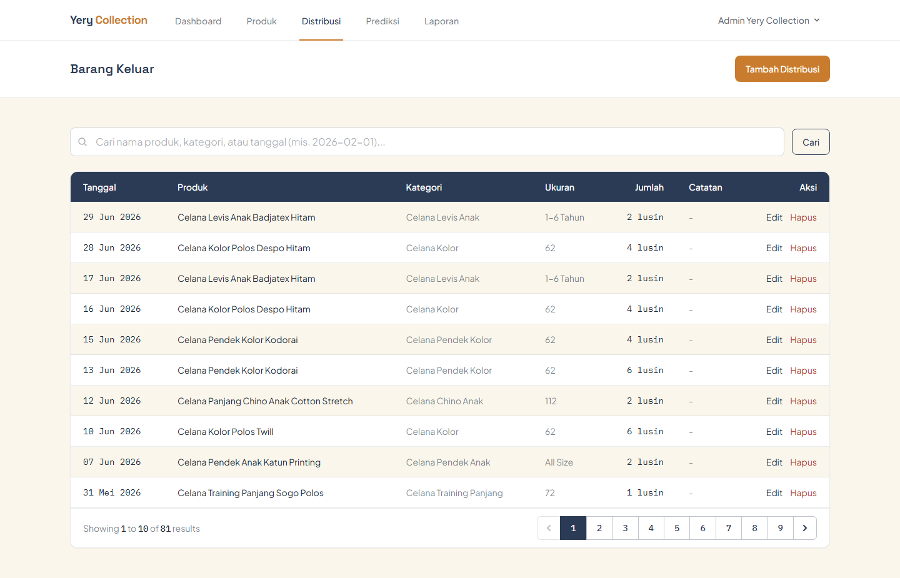
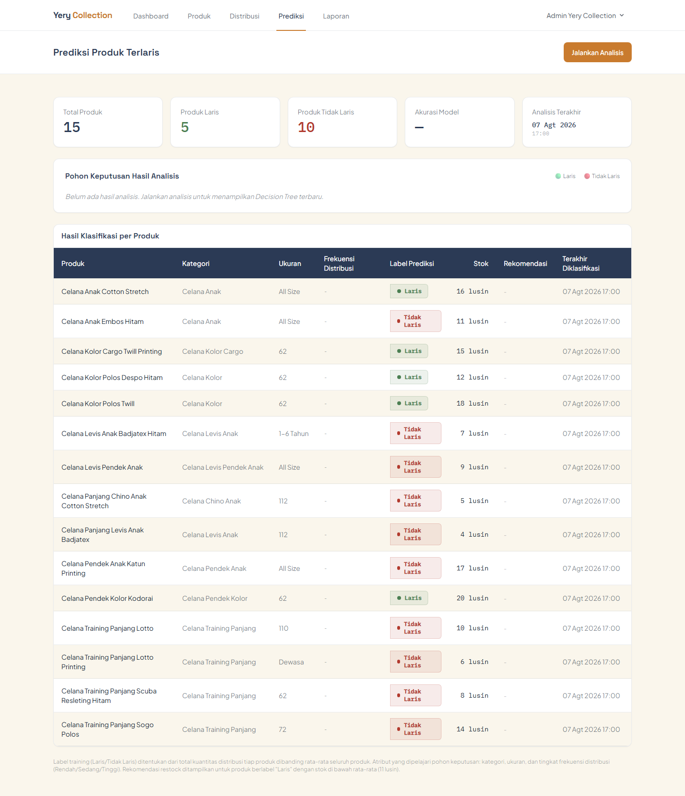
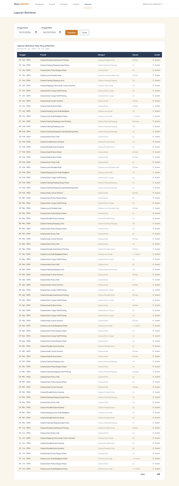

# Sistem Distribusi Yery Collection

**Implementasi Sistem Distribusi untuk Memprediksi Produk Terlaris dengan Algoritma C4.5 Berbasis Website pada Toko Yery Collection**


## Deskripsi Singkat

Aplikasi web untuk mengelola pencatatan distribusi barang keluar pada Toko Yery Collection (usaha grosir celana anak), sekaligus memprediksi produk terlaris menggunakan algoritma klasifikasi C4.5 berdasarkan data historis distribusi. Dibangun dengan Laravel 12 sebagai project skripsi (tugas akhir), dengan satu aktor pengguna (Admin/Pemilik Toko).

## Latar Belakang

Pencatatan distribusi barang di Toko Yery Collection selama ini dilakukan secara manual di buku catatan. Cara ini membuat data mudah hilang atau rusak, rekapitulasi memakan waktu lama, dan penentuan produk yang dianggap laris hanya mengandalkan ingatan serta perkiraan pribadi pemilik toko — tanpa dasar data yang objektif. Sistem ini dibangun untuk menggantikan proses tersebut dengan pencatatan digital yang terstruktur, dilengkapi analisis prediksi produk terlaris berbasis algoritma C4.5 agar keputusan pengisian ulang stok (restock) dapat diambil berdasarkan data historis, bukan perkiraan.

## Preview

<details>
<summary>Dashboard</summary>



</details>

<details>
<summary>Data Produk</summary>



</details>

<details>
<summary>Distribusi (Barang Keluar)</summary>



</details>

<details>
<summary>Prediksi Produk Terlaris</summary>



</details>

<details>
<summary>Laporan Distribusi</summary>



</details>

## Fitur Utama

- **Autentikasi Admin** — login dan logout untuk satu akun Admin (Pemilik Toko).
- **Dashboard** — ringkasan jumlah produk, jumlah distribusi, grafik distribusi 6 bulan terakhir, daftar produk terlaris, hasil prediksi terbaru, dan rekomendasi restock.
- **Kelola Data Produk** — tambah, ubah, hapus (soft delete), dan pencarian produk secara live (tanpa reload halaman).
- **Kelola Data Distribusi** — tambah, ubah, hapus, dan pencarian data barang keluar secara live, dengan stok produk yang disesuaikan otomatis setiap kali terjadi transaksi.
- **Prediksi Produk Terlaris** — menjalankan analisis klasifikasi C4.5 terhadap data distribusi, menampilkan visualisasi pohon keputusan, nilai akurasi model, label prediksi tiap produk, dan rekomendasi restock untuk produk berlabel "Laris" dengan stok menipis.
- **Laporan Distribusi** — laporan barang keluar per rentang tanggal, dengan opsi cetak melalui fitur print bawaan browser.

## Algoritma C4.5

Prediksi produk terlaris dihitung menggunakan algoritma C4.5 yang diimplementasikan langsung dalam PHP (tanpa library machine learning eksternal). Setiap produk direpresentasikan oleh tiga atribut kategorikal — **kategori**, **ukuran**, dan **tingkat frekuensi distribusi** (hasil diskritisasi jumlah transaksi menjadi Rendah/Sedang/Tinggi) — dengan label kelas **Laris** atau **Tidak Laris** yang ditentukan dari perbandingan total kuantitas distribusi produk terhadap rata-rata keseluruhan. Pemilihan atribut pemecah pada setiap simpul pohon menggunakan **Gain Ratio** (Entropy, Information Gain, dan Split Information dihitung lebih dulu) — ciri khas C4.5 yang membedakannya dari ID3, karena menghindari bias terhadap atribut yang memiliki banyak nilai unik.

## Tech Stack

- **Backend**: Laravel 12 (PHP ^8.2)
- **Database**: MySQL
- **Frontend**: Blade Templating, Tailwind CSS 3, Alpine.js
- **Build Tool**: Vite
- **Autentikasi**: Laravel Breeze (stack Blade)

## Arsitektur Singkat

Aplikasi mengikuti arsitektur **MVC standar Laravel**: Controller menangani request dan alur bisnis, Model (Eloquent) merepresentasikan data, Form Request menangani validasi input secara terpisah dari Controller, dan Blade View untuk tampilan. Logika algoritma C4.5 diisolasi ke dalam satu **Service class**, `App\Services\C45Classifier`, sehingga perhitungan Entropy, Gain, Split Information, Gain Ratio, pembentukan pohon keputusan, dan klasifikasi tidak bercampur dengan kode Controller. Tidak ada layer Repository maupun API terpisah — aplikasi murni berbasis web session dengan Blade.

## Struktur Folder Utama

```
app/
├── Http/Controllers/   # DashboardController, ProductController, DistributionController,
│                       # PredictionController, ReportController, dll.
├── Http/Requests/      # Form Request untuk validasi input
├── Models/             # User, Product, Distribution
└── Services/           # C45Classifier.php (implementasi algoritma C4.5)

database/
├── migrations/         # Struktur tabel users, products, distributions
└── seeders/            # DatabaseSeeder, ProductSeeder, DistributionSeeder

resources/
├── views/              # Blade views (dashboard, products, distributions, predictions, reports)
└── js/app.js           # Alpine.js, termasuk komponen live search

routes/
└── web.php             # Seluruh route aplikasi
```

## Requirements

- PHP >= 8.2
- Composer
- Node.js & NPM
- MySQL

## Instalasi

```bash
git clone https://github.com/KiyyKen/ery-collection.git
cd ery-collection

composer install
npm install
```

## Konfigurasi .env

```bash
cp .env.example .env
php artisan key:generate
```

Buat database MySQL kosong, lalu sesuaikan variabel berikut pada file `.env`:

```env
DB_CONNECTION=mysql
DB_HOST=127.0.0.1
DB_PORT=3306
DB_DATABASE=ery_collection
DB_USERNAME=root
DB_PASSWORD=
```

## Migrasi Database

```bash
php artisan migrate
```

## Seeder

```bash
php artisan db:seed
```

atau langsung sekaligus migrasi ulang:

```bash
php artisan migrate:fresh --seed
```

Seeder akan mengisi:

- 1 akun Admin.
- **15 data produk asli Toko Yery Collection** (nama, kategori, ukuran, harga, dan stok sesuai hasil wawancara langsung dengan pemilik toko, satuan dalam lusin).
- Data distribusi historis dengan **fixed random seed**, sehingga setiap `migrate:fresh --seed` selalu menghasilkan dataset yang identik dan hasil klasifikasi C4.5 dapat direproduksi secara konsisten.

## Menjalankan Aplikasi

```bash
php artisan serve
npm run dev
```

Aplikasi dapat diakses di `http://localhost:8000`.

## Default Login

| Email | Password |
|---|---|
| `admin@erycollection.test` | `password` |

*(sesuai `database/seeders/DatabaseSeeder.php`)*

## Alur Prediksi

1. Admin membuka halaman Prediksi dan menekan tombol **"Jalankan Analisis"**.
2. Sistem mengambil seluruh data produk beserta agregat distribusinya (total kuantitas dan jumlah transaksi).
3. Jumlah transaksi tiap produk didiskritisasi menjadi tingkat frekuensi **Rendah/Sedang/Tinggi** berdasarkan persentil.
4. Label latih **Laris/Tidak Laris** ditentukan dari perbandingan total kuantitas distribusi produk terhadap rata-rata seluruh produk.
5. Algoritma C4.5 membangun pohon keputusan dari data latih tersebut.
6. Setiap produk diklasifikasikan menggunakan pohon yang terbentuk, dan hasilnya (`predicted_label`) disimpan ke data produk.
7. Sistem menghitung akurasi model, lalu menampilkan pohon keputusan, akurasi, label prediksi tiap produk, dan rekomendasi restock pada halaman Prediksi.

## Project Status

> ✅ Completed (Thesis Project)

## License

Project ini dikembangkan sebagai tugas akhir (skripsi) di Universitas Pamulang. Source code dipublikasikan melalui GitHub untuk keperluan dokumentasi dan portfolio. Hak cipta tetap dimiliki oleh penulis, dan project ini tidak dirilis di bawah lisensi open-source seperti MIT.

## Author

**Rizky Ariyan**

Universitas Pamulang

GitHub:
[https://github.com/KiyyKen](https://github.com/KiyyKen)
